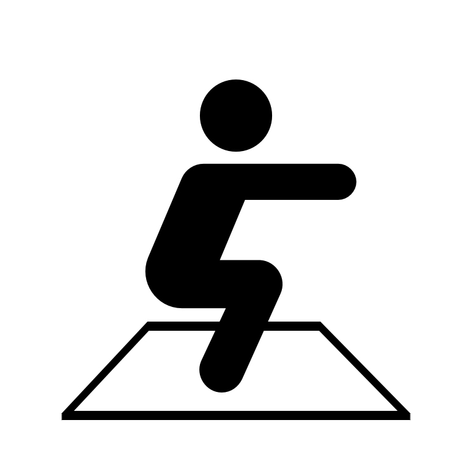
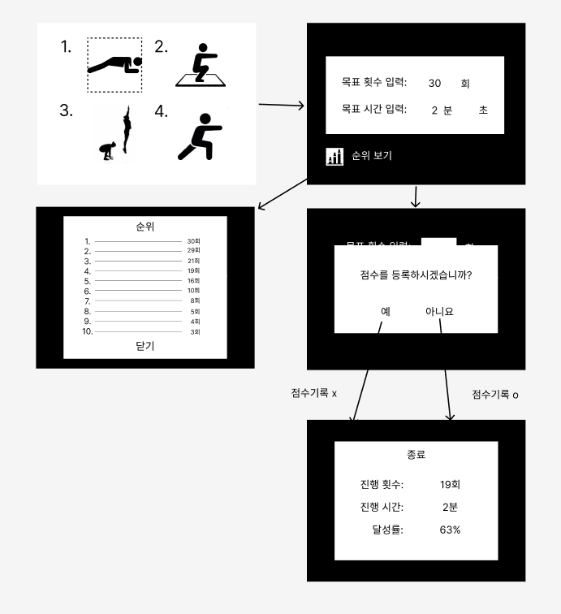

# 무선네트워크 4조

💪운동 도우미 시스템

## 🎯 목적

- 카메라와 인공지능 기술을 결합하여 사용자의 운동을 장려하는 시스템을 개발하고자 합니다.

## 👥 조원

- 조장
  - 정성민 (qwer1227) - DB연동, 데이터베이스 값 저장 및 추출
    
- 조원
  
  - 박상원 (qarksangwon) - 푸시업 동작 및 기능 구현 (타이머)
  - 반진성 (banjinseong) - 레이즈 동작 및 기능 구현
  - 김상헌 (inhaexpress) - 스퀏 동작 및 기능 구현
  - 오주헌 (dhwngjs01)  - 런지 동작 및 기능 구현 (프로그레스 바)
  - 신수민 (StarlightSSM) - UI 및 메인페이지 

## 🔧주요 기능

#### 운동 목표치 및 달성도 설정

- 운동동작(푸쉬업, 스쿼트, 레이즈, 런지) 선택
- 목표 횟수와 시간 선택

#### 플레이 화면

- 운동 모습을 볼 수 있는 화면구성 (카메라와 너무 가깝거나 멀리 가지 않게)
- 목표 횟수와 현재 횟수, 시간을 볼 수 있게 구성

#### 점수 등록

- 2분을 기준으로 각 운동 횟수가 많은 순으로 10위까지 이름등록

## 💻개발 환경

JavaScript, db(firebase)

## ✔UI 아이콘 설정

## 메인 화면

- 운동 선택 버튼 4개(푸쉬업, 스쿼트, 레이즈, 런지) 각각 아이콘으로 표시
- 4개의 버튼 각각 옆에 점수 버튼을 표시

  

  |                          푸쉬업                           |                          스쿼트                           |                             레이즈                              |                          런지                           |
  | :-------------------------------------------------------: | :-------------------------------------------------------: | :-----------------------------------------------------------: | :-----------------------------------------------------: |
  |  |  |  |  |

  

   

  

  |                          점수 버튼                           |
  | :----------------------------------------------------------: |
  |  |

  

## 전체 UI 화면

  

    
  

## 파이어베이스 SDK모듈 가져오기
  
  
  Firebase 모듈에서 initializeApp 함수를 가져와 Firebase 앱을 초기화하고, 데이터베이스 조작을 위해 필요한 함수들을 가져옵니다.

## 파이어베이스 설정
  
  
  Firebase 앱을 초기화할 때 필요한 설정 정보를 담은 객체입니다. 이 정보는 Firebase 프로젝트 설정에서 얻을 수 있으며, API 키, 프로젝트 ID, 데이터베이스 URL 등이 포함되어 있습니다.

## 파이어베이스 초기화 및 데이터 추가
  
  
  Firebase 앱을 초기화하고 앱 객체를 생성하며 push 함수를 사용하여 데이터를 추가합니다.

## 파이어베이스 저장 결과
  

  push 함수를 통해 realtime데이터베이스에 값이 정상적으로 들어갔음을 보여주는 이미지입니다.

## 11-21 ~ 11-27

### 메인 화면

  

### 목표 선택 화면

  

### 운동 화면

  

### 운동 화면 예시)

  

### 운동 종료 후 데이터베이스 저장

  

