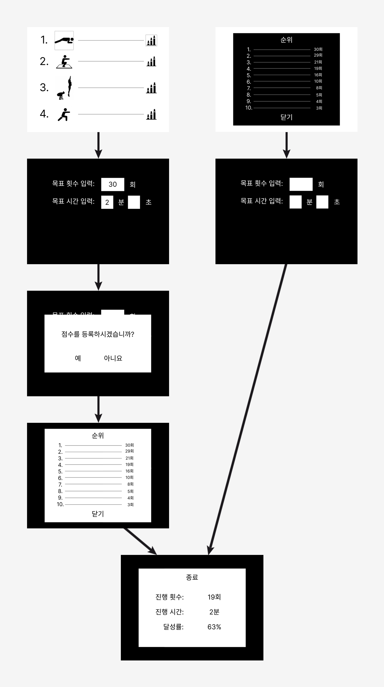

# 무선네트워크 4조
💪운동 도우미 시스템

## 🎯목적 
* 카메라와 인공지능 기술을 결합하여 사용자의 운동을 장려하는 시스템을 개발하고자 합니다.

### 👥조원
* 조장 : 정성민 
* 조원 : 박상원 반진성 김상헌 오주헌 신수민

## 🔧주요 기능
#### 운동 목표치 및 달성도 설정
* 운동동작(푸쉬업, 스쿼트, 버피, 런지) 선택
* 목표 횟수와 시간 선택

#### 플레이 화면
* 운동 모습을 볼 수 있는 화면구성 (카메라와 너무 가깝거나 멀리 가지 않게)
* 목표 횟수와 현재 횟수, 시간을 볼 수 있게 구성

#### 점수 등록
* 2분을 기준으로 각 운동 횟수가 많은 순으로 10위까지 이름등록

## 💻개발 환경
JavaScript, db(firebase)

## ✔UI 아이콘 설정(논의 필요)
## 메인 화면
* 운동 선택 버튼 4개(푸쉬업, 스쿼트, 버피, 런지) 각각 아이콘으로 표시
* 4개의 버튼 각각 옆에 점수 버튼을 표시
  </img>
  </img>
  </img>
  </img>

* 점수 버튼
  

## 전체 UI 화면
</img>
